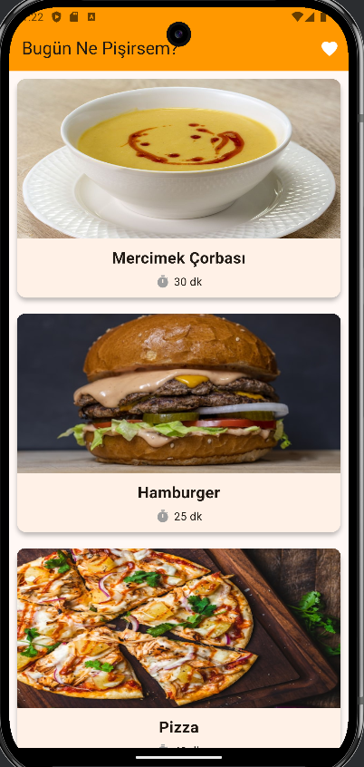
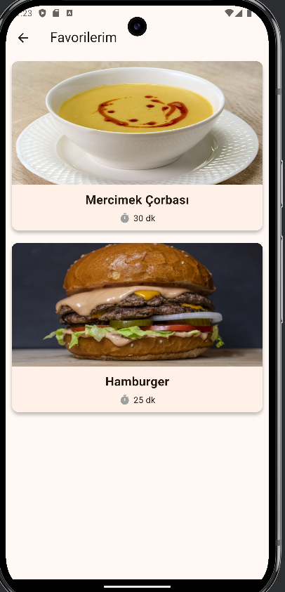
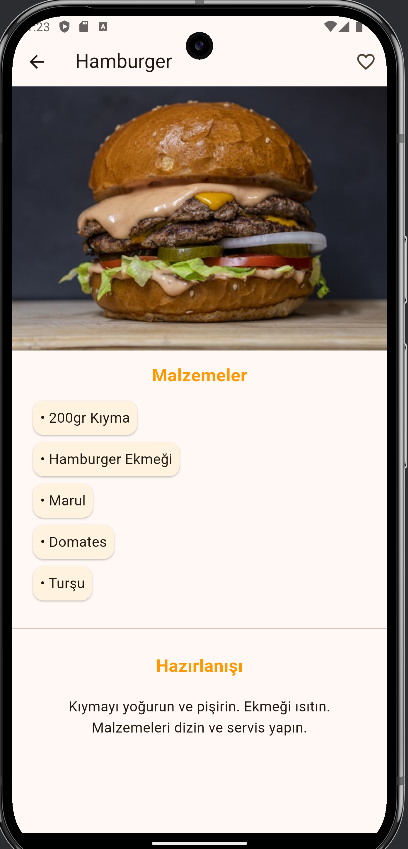

\# 🥑 Akıllı Tarif Defteri (Recipe App)


Flutter ile geliştirilmiş, kullanıcıların yemek tariflerini keşfedebileceği, detaylarını inceleyebileceği ve favorilerine ekleyebileceği modern bir mobil uygulama.


Bu proje, \*\*Junior Flutter Developer\*\* yetkinliklerini (State Management, Navigation, Clean Architecture) sergilemek amacıyla geliştirilmiştir.


\## 📱 Özellikler


\* \*\*Tarif Listeleme:\*\* Yüksek performanslı `ListView.builder` ile optimize edilmiş liste görünümü.

\* \*\*Detay Sayfası:\*\* Tariflerin malzemeleri, yapılış adımları ve süre bilgileri.

\* \*\*Favori Yönetimi:\*\* `Provider` paketi kullanılarak geliştirilmiş favorilere ekleme/çıkarma sistemi.

\* \*\*Resim Optimizasyonu:\*\* `cacheHeight` ve `cacheWidth` ile hafıza dostu görsel yükleme.

\* \*\*Temiz Arayüz:\*\* Kullanıcı deneyimine (UX) odaklı, modern kart tasarımları.


\## 🛠️ Kullanılan Teknolojiler ve Paketler


\* \*\*Flutter \& Dart\*\*

\* \*\*State Management:\*\* Provider

\* \*\*Navigation:\*\* Flutter Navigator 1.0 (Push/Pop)

\* \*\*Architecture:\*\* MVC Pattern (Model-View-Controller esintili klasör yapısı)

\* \*\*Data:\*\* Local Mock Data \& Unsplash Images


| Ana Sayfa | Detay Sayfası | Favoriler |

|  |  |  |


\## 📂 Klasör Yapısı (Folder Structure)


```text

lib/

├── models/         # Veri modelleri (Recipe Class)

├── providers/      # State Management (RecipeProvider)

├── screens/        # Uygulama sayfaları (Home, Detail, Favorites)

├── widgets/        # Tekrar kullanılabilir UI parçaları (RecipeCard)

└── main.dart       # Uygulamanın başlangıç noktası

